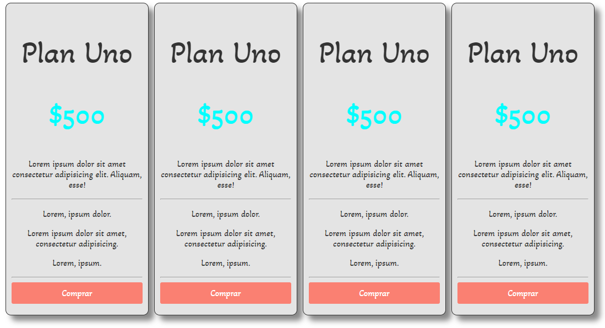
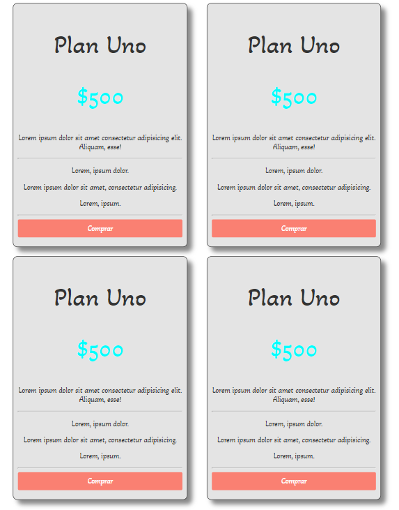
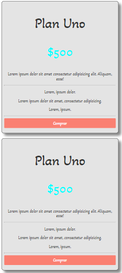

# responsive-flexbox-forms-css
Realizando unas cajas de precios responsivas mediante el uso de flexbox

-Pantalla Completa: 



-Pantalla en un tamaño menor o igual a 1070px: 



-Pantalla en un tamaño menor o igual a 600px: 



1. Codigo HTML para realizar cada caja de precios: 

```
<section class="container flex text-center">
        <div class="columna">
            <h2>Plan Uno</h2>
            <p class="precio">$500</p>
            <p>Lorem ipsum dolor sit amet consectetur adipisicing elit. Aliquam, esse!</p>
            <hr>
            <!--linea de division-->
            <p>Lorem, ipsum dolor.</p>
            <p>Lorem ipsum dolor sit amet, consectetur adipisicing.</p>
            <p>Lorem, ipsum.</p>
            <hr>
            <a href="#" class="btnPrecio">Comprar</a>
        </div>
 </section>
 ```
 
 
 2. Codigo CSS para los estilos de las cajas de precios: 
 ```
 body{
    font-family: 'Akaya Telivigala', cursive;/*google font*/
}
h2{
    font-weight: 500;/*ancho de letra*/
    font-size: 55px;/*tamaño de letra plan 1*/
}
.container{
    margin: 0 auto;/*bordes a los lados*/
    width: 80%; /*ancho de cada tabla de precios*/
}
.flex{
    display: flex;/*pasar de horizontal a vertical*/
    flex-wrap: wrap;/*RESPONSIVE*/
}
.text-center{
    text-align: center;
}
.precio{
    font-size: 50px;/*hacer mas grande el precio $500*/
    color: aqua;/*color de precio 500*/
}
.columna{
    background-color: rgb(228, 228, 228);/*color fondo de cada caja*/
    color: #333;/*color de todo el texto de cada caja*/
    border: 1px solid #333;/*color y ancho de borde exterior gris*/
    margin: 0 auto;/*margen para separar cada caja (ejes y es 0, ejes x es automatico y condidera el 24% del width en la linea 31*/
    padding: 10px;/*padding para alejar el contenido de adentro de la caja*/
    border-radius: 10px; /*borde redondeado*/
    box-shadow: 10px 10px 10px #888;/*sombra de cada caja (lados, ariba o abajo, degradado)*/
    width: 24%;/*RESPONSIVE*/
    box-sizing: border-box;/*RESPONSIVE*/
}
.btnPrecio{
    background: salmon;
    display: block; /*100 porciento de ancho*/
    padding: 10px;/*10px en todos los bordes internos*/
    color: #fff;/*color de letra*/
    text-decoration: none;/*quitar la linea del a href*/
    border-radius: 3px;/*borde redondeado de boton*/
    margin-bottom: 10px;/*margen de fondo para alejar el boton de la caja exterior*/
}
.btnPrecio:hover{/*cambiar el color del boton con hover*/
    background: rgb(250, 93, 75);
}

/*RESPONSIVE: El siguiente codigo solo se ejecuta cuando el tamaño sea menor o igual a 1070px*/
@media (max-width: 1070px){
.columna{
    width: 45%;/*es 45 para que haiga 2 cuadros por fila*/
    margin-bottom: 20px;/*para que no esten pegados horizontalmente los cuadros*/
}
}

/*RESPONSIVE: El siguiente codigo solo se ejecuta cuando el tamaño sea menor o igual a 600px*/
@media (max-width: 600px){
    .columna{
        width: 100%; /* es 100 para que aiga un cuadro por fila*/
        margin-bottom: 20px;   /*para que no esten pegados horizontalmente los cuadros*/
    }
    }
```
